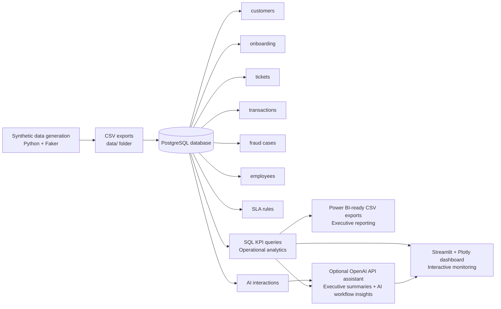

# Architecture

## Explanation

**Data layer:** Synthetic banking operations data is generated with Python and Faker, exported as CSV files in the `data/` folder, and loaded into PostgreSQL tables for customers, onboarding, tickets, transactions, fraud cases, employees, SLA rules, and AI interactions.

**Analytics layer:** SQL KPI queries run against PostgreSQL to produce operational metrics for service performance, onboarding, fraud operations, transaction monitoring, SLA compliance, and AI usage.

**AI layer:** The optional OpenAI API assistant uses operational data and AI interaction records to generate executive summaries and workflow insights.

**Visualization layer:** Streamlit and Plotly provide an interactive monitoring dashboard for operational users, while Power BI-ready CSV exports support executive reporting.

**Portfolio/business value:** The project demonstrates an end-to-end enterprise banking analytics platform that connects realistic data generation, relational modeling, KPI analytics, AI-assisted insight generation, and executive-ready reporting.
